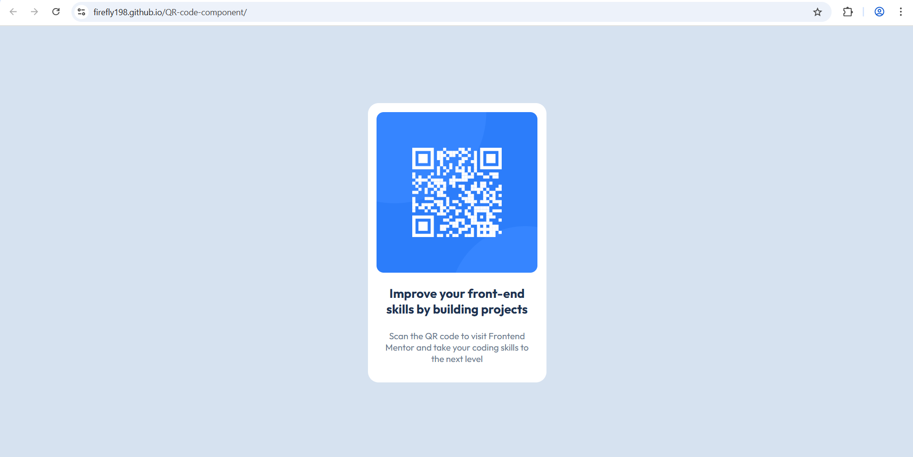

# Frontend Mentor - QR code component solution

This is a solution to the [QR code component challenge on Frontend Mentor](https://www.frontendmentor.io/challenges/qr-code-component-iux_sIO_H). Frontend Mentor challenges help you improve your coding skills by building realistic projects. 

## Overview
I really likes this one. I think it's the best challange for begginers, who need practise.

### Screenshot



### Links

- Solution URL: https://www.frontendmentor.io/solutions/qr-code-component---my-first-solution-using-htmlcss-p_njbMF1kq
- Live Site URL: https://firefly198.github.io/QR-code-component/

## My process

### Built with

- Semantic HTML5 markup
- Flexbox
- Mobile-first workflow
- CSS

### What I learned

I learned using Flexbox

```css
.proud-of-this-css {
      display: flex;
      flex-direction: column;
      justify-content: flex-start;
      align-items: center;
      gap: 22px;
}
```

### Continued development

I am really confused how to select font sizes, bacause there were no buttons and then AI gave me font links. I hope 
someone will teach me that.


### Useful resources

This site below really thought me a lot of things
https://www.w3schools.com/

## Author

- Frontend Mentor - [Nick](https://www.frontendmentor.io/profile/firefly198)

